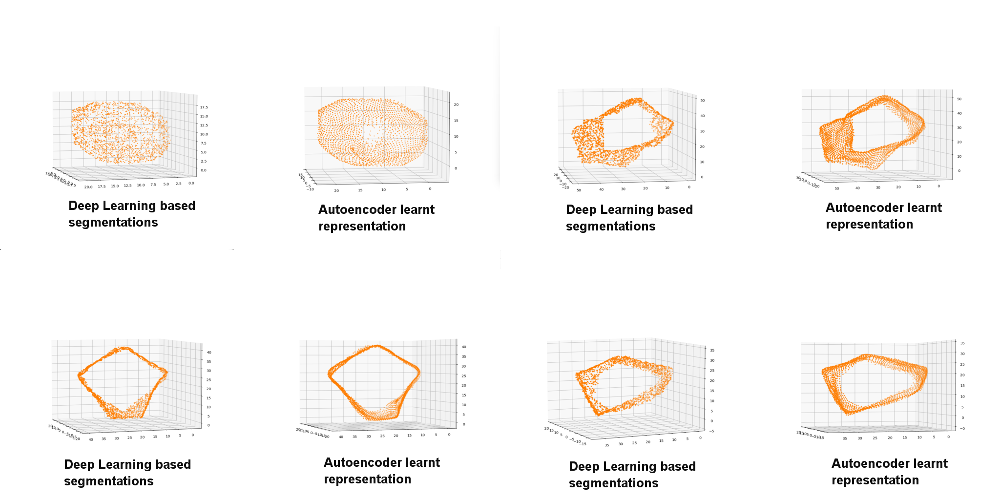

# Algorithm
## Segmentation and Tracking
VollSeg has multiple model combinations for obtaining segmentations, some of its combination are more suited for certain image and microscopy types, the details
of whcih can be found in the [VollSeg repository](https://github.com/Kapoorlabs-CAPED/VollSeg). The output of segmentation are instance labels for 2D, 3D, 2D + time,
and 3D + time datasets. The aim of obtaining these labels is accurate quantification of cell shapes as that is usually a biological aim for researchers interested in
cell fate quantification and this tool was made as a [Napari grant action](https://chanzuckerberg.com/science/programs-resources/imaging/napari/vollseg-extensions-and-workflow-development-with-user-support/)
to achieve that purpose in cell tracking. Simply using algorithms like Marching Cubes on the segmentation labels that come out of AI approaches is akin to giving up
when victory is in sight, in our algorithm we train an autoencoder model to obtain point cloud representation of the segmentation labels and as is evitable from the
 with classical computation approaches, the point cloud representation achieved therby is far superior. In our algorithm
the segmentation labels coming from VollSeg along with Raw image of the cells and tissue boundary mask of those cells serve as an input to this plugin. The tracking
is performed prior to using this plugin in Fiji using TrackMate, which is the most popular tracking solution with track editing tools in Fiji. The out put of that plugin
are xml and [tracks, spots and edges csv files] that serve as an input to this plugin. We also provide pre-trained auto encoder models for nuclei and membrane that can
be used to obtain the point cloud representation of the segmented cells. The users can also provide their own autoencoder models if they have trained them on their data.

## Point Clouds

As a first step the users apply the trained autoencoder models on the input timelapse of segmentation and in the plugin point cloud representation of all the cells in
the tracks are computed. We provide a [script](examples/visualize_point_clouds.py) to visualize point cloud representation for the input segmentation image (binary) using classical and autoencoder model predictions.

## Autoencoder

This is an algorithm developed by [Sentinal](https://www.sentinal4d.com/) AI startup of the UK and they created a [pytorch](https://github.com/Sentinal4D) based program to train autoencoder models that
generate point cloud representations. KapoorLabs created a [Lightning version](https://github.com/Kapoorlabs-CAPED/KapoorLabs-Lightning) of their software that allows for multi-GPU training.

## Shape Features

## Dynamic Features
